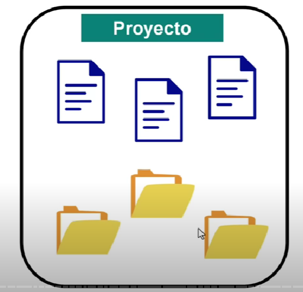

# Apuntes de Git (freeCodeCamp)

**Sistema de control de versiones** que facilita el seguimiento de los cambios en un conjunto de archivos. Git solo funciona de manera local.

  

## Contenido

1. [Configurar usuario y correo](curso-git/user-email.md)
2. [Repositorio](curso-git/repo.md)
3. [Tres áreas de Git](curso-git/areas.md)
4. [Commits](curso-git/commit.md)
5. [Ramas en Git](curso-git/branch.md)

Estos apuntes fueron elaborados gracias a [Aprende Git y GitHub - Curso desde Cero](https://www.youtube.com/watch?v=mBYSUUnMt9M) de **freeCodeCamp**.