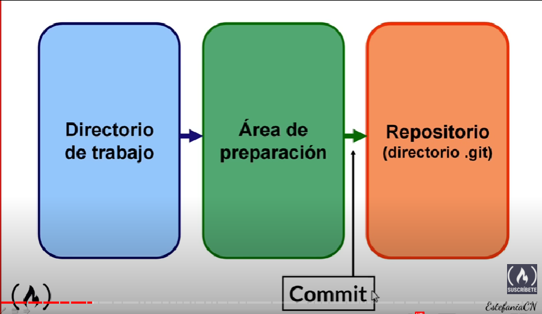
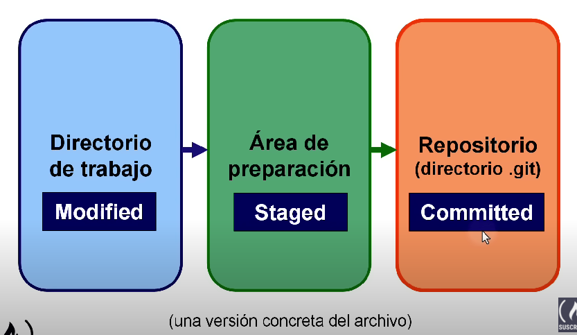

# Áreas y estados en Git

Explica como se divide el proceso para llevar un archivo desde el directorio de trabajo hasta el repositorio.

## Tres áreas

<dl>
  <dt>Working directory</dt>
  <dd>Carpeta que contiene a todos los archivos, sub carpetas y al directorio .git</dd>

  <dt>Staging area</dt>
  <dd>Área donde se organizan los cambios que deseas incluir en tu próxima confirmación. Esta área facilita la revisión y la posibilidad de retractarte antes de realizar un commit, ya que te permite elegir qué modificaciones serán parte de la siguiente confirmación.</dd>

  <dt>Repository</dt>
  <dd>Directorio que contiene todos los metadatos y las versiones del proyecto. Parte que se copia cuando clonas un repositorio además es la parte más importante de Git.</dd>
</dl>

## Tres estados

<dl>
  <dt>Modificada</dt>
  <dd>Es la versión del archivo que contiene cambios que <b>no</b> son parte del repositorio y <b>no</b> se ha añadido al área de preparación.</dd>

  <dt>Preparada</dt>
  <dd>Versión del archivo que contiene cambios que <b>no</b> son parte del repositorio, pero fue <b>añadida</b> al área de preparación.</dd>

  <dt>Confirmada</dt>
  <dd>Versión del archivo que ya fue <b>añadida</b> al repositorio, es decir que ya se encuentra en el directorio de Git.</dd>
</dl>

## Comandos

| Comando | Explicación |
|---------|-------------|
| `git status` | Muestra el estado actual de tu repositorio Git. |
| `git add file` | Agrega el archivo modificado al área de preparación. |
| `git add .` | Agrega todos los archivos modificados al área de preparación. |
| `git rm --cached file` | Elimina el archivo del repositorio, pero lo mantiene en el disco duro. |
| `git rm file` | Elimina el archivo del repositorio y del disco duro. Si el archivo ha sido modificado desde el último commit, Git arrojará un error, para eso fuerza (-f) la eliminación. |
| `git clean --opcion` | Actúa en archivos que **nunca** se agregaron al área de preparación.     **--dry-run:** Lista los archivos sin seguimiento.   **-f:** Elimina los archivos listados de no seguimiento. |