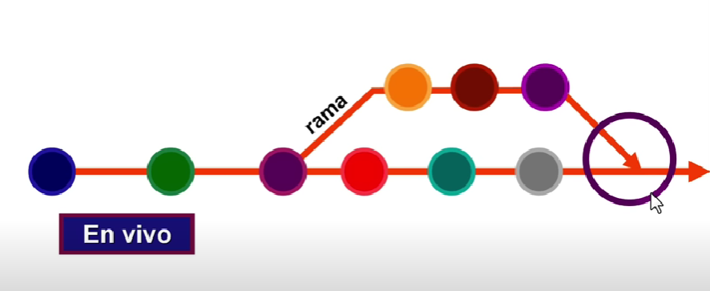
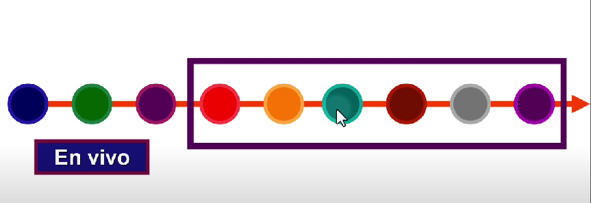
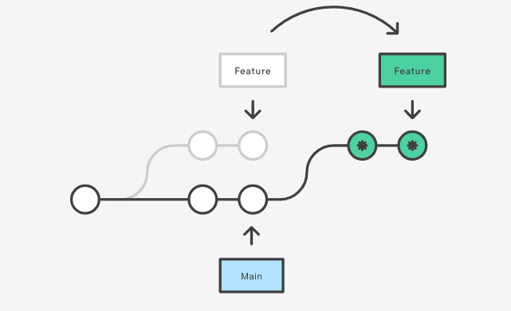

# Ramas en Git

Una rama en Git es **una línea independiente de desarrollo** en el repositorio. Permite crear versiones del proyecto que puede evolucionar de manera independiente de otras ramas.

## Comandos

| Comando | Descripción |
|---------|-------------|
| `git branch rama` | Crea una rama. Inicialmente, las ramas son exactamente igual a la rama que la genero. |
| `git branch` | Muestra solo las ramas locales, resaltando la rama actual.     **-r:** Muestra solo las ramas remotas   **-a:** Muestra todas las ramas, tanto locales como remotas.   **-v:** Muestra información adicional sobre cada rama, como el nombre de cada rama, también muestra el último commit realizado en esa rama y el mensaje del commit asociado. |
| `git checkout rama` o `git switch rama` | Cambia de rama. `git switch rama` es un comando reciente. |
| `git checkout -b rama` o `git switch -c rama` | Crear una nueva rama con el nombre especificado y cambia a ella inmediatamente. |
| `git branch -m rama` | Cambia el nombre de una rama existente. Debes estar en la rama que deseas renombrar. |
| `git branch -m nombre-viejo nuevo-nuevo` | Cambia el nombre de una rama existente, no es necesario que estes en la rama que deseas a renombrar. |
| `git cherry-pick SHA` | Útil cuando quieres traer cambios específicos de una rama a otra sin fusionar toda la rama. |
| `git branch -d rama` | Elimina una rama. Si la rama no se fusionó, entonces Git mostrara un mensaje de error y no se eliminará la rama. |
| `git branch -D rama` | Fuerza la eliminación de la rama, incluso si la rama no se fusionó. |

## Fusionar ramas

1. `git merge rama`

Permite combinar los cambios de dos ramas diferentes, creando un nuevo commit de fusión uniendo los cambios de dos ramas. Este nuevo commit se coloca en la historia del proyecto como un punto donde las dos ramas se unen, y el puntero HEAD se mueve al nuevo commit de fusión, que está un commit adelante de la posición anterior. **Para fusionar dos ramas, debes estar en la rama que recibirá la fusión.**

Los commits de la rama fuente se integran en la rama objetiva en orden cronológico, es decir, según el momento en que se realizaron los commits en la rama fuente.

    

2. `git Rebase rama`

Los commits de la rama que está siendo rebasada (la rama actual) se aplican uno por uno sobre la punta de la rama objetiva. Esto reescribe el historial de la rama rebasada, creando una **línea de tiempo más limpia y fácil de leer**. Sin embargo, al **no mantener la trazabilidad cronológica original de los commits y no generar un commit de fusión, su uso no se recomienda en repositorios remotos**, ya que puede causar confusión y problemas de colaboración.

## Confictos al fusionar ramas

Un conflicto ocurre en Git cuando se realizan cambios en la misma parte de un archivo en diferentes ramas y luego se intenta fusionar estas ramas.

Los conflictos surgen por ejemplo, cuando se realizan cambios en la misma sección del archivo en la rama original después de haber realizado modificaciones en la misma sección del archivo en la rama de fusión. Esto sucede porque Git no puede decidir automáticamente cuál versión de los cambios debe conservarse, lo que requiere una intervención manual para resolver el conflicto.

Utiliza `git merge --abort` para abortar un proceso de fusión que está en curso y volver al estado anterior a la fusión.

### Importante:

- Una vez resuelto el conflicto desde VSCode continua con el proceso de fusión ejecutando `git merge --continue`.
- Git pedirá que agregues un mensaje al commit que se creó. Git crea un commit automáticamente para registrar la resolución del conflicto.

## Recordatorio

- Por convención, las ramas se escriben en minúscula y las palabras se conectan con guion.
- Para eliminar una rama debes estar en otra rama o preferiblemente en la rama principal.
- git log en una rama muestra los commits de esa rama y los de la rama donde se originó.