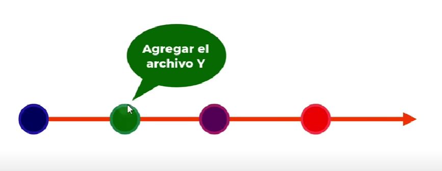
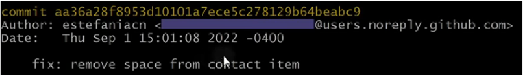

# Commit

Registro o "foto" del estado de un proyecto en un momento específico.

## Estructura

- Git asigna a cada commit un identificador único llamado SHA (Secure Hash Algorithm).
- Cada commit tiene un mensaje asociado donde se escribe el tipo de cambio y que fue lo que se cambió o hizo en ese momento.

## Comandos

| Comando | Descripción |
|---------|-------------|
| `git commit -m "mensaje"` | Registra los cambios y agrega un mensaje para ese commit. |
| `git commit -am "mensaje"` | Permite fusionar `git add .` con `git commit -m "mensaje"`. **No funciona con archivos nuevos**. |
| `git commit` | Registra los cambios y permite agregar un mensaje desde el editor asociado. |
| `git config --global core.editor "code --wait"` | Configura VSCode como el editor predeterminado para Git. La opción "wait" hace que Git espere a que se cierre la ventana antes de continuar. |
| `git commit --amend` | Modifica el último commit. Es considerado una mala práctica, especialmente después de haber hecho push o pull al repositorio, ya que modifica el historial de commits al cambiar el SHA del último commit. |
| `git restore file` | Si tienes cambios en tu directorio de trabajo, pero aún no los has agregado al área de preparación, utiliza este comando para deshacer los cambios y restaurar el archivo al estado del último commit.     **--staged:** Restaura el archivo al estado en el que estaba antes de ser agregado al área de preparación. |
| `git log` | Muestra el historial de commits que se han realizado. |
| `git log --oneline` | Cada commit se muestra en una línea. |
| `git log -p` | Muestra las líneas agregadas (+) y eliminadas (-) para cada commit. |
| `git diff` | Se centra en mostrar las diferencias entre distintos puntos del código.     `git diff` Compara el índice (área de preparación) con el directorio de trabajo actual.   `git diff --cached` Compara el índice con el último commit.   `git diff commitA commitB` Compara un commit con otro. |
| `git checkout SHA` | Permite desplazarnos a un commit específico, entrando en un estado **desconectado** fuera de cualquier rama existente. Los commits realizados en este estado no se eliminan del historial de Git, pero pueden resultar difíciles de acceder, si no se crea una rama que contenga los commits. |
| `git reset --opción HEAD~1` | Sitúa el punto HEAD un commit por detrás y elimina el último commit.     **--soft:** Elimina el commit, pero mantiene los cambios en el área de preparación y directorio de trabajo.   **--mixed (Por defecto):** Elimina el commit y el área de preparación, pero conserva los cambios en el directorio de trabajo.   **--hard:** Elimina el commit, área de preparación y directorio de trabajo. |
| `git reset --opción SHA` | El puntero se coloca en el commit especificado y todos los commits posteriores se eliminan del historial. |
| `git tag version` | Las etiquetas se usan para marcar puntos clave en la historia de un repositorio. Al etiquetar un commit, puedes referirte a él fácilmente usando el nombre de la etiqueta en lugar de su SHA. Al ejecutar `git tag` listas todas las etiquetas y si deseas eliminar un tag usa `git tag -d nombre`. |

## Diferencia entre rm y reset

- **rm:** Se utiliza para eliminar archivos del área de trabajo, índice o del disco duro.
- **reset:** Se utiliza para mover el puntero HEAD a un commit específico.

## Buenas prácticas

- Modifica el historial de commits solo localmente para evitar conflictos con otros desarrolladores.
- Es más fácil corregir un commit apenas lo notes, ya que modificar mensajes de confirmaciones antiguas puede resultar complicado.